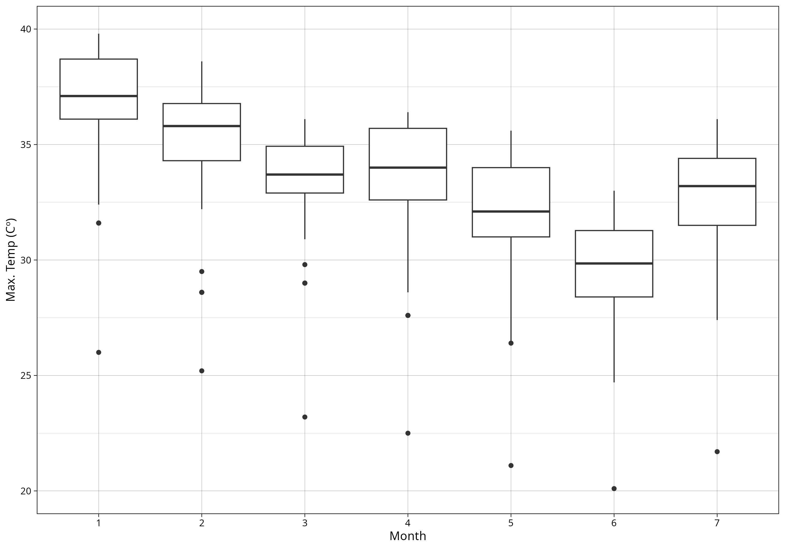
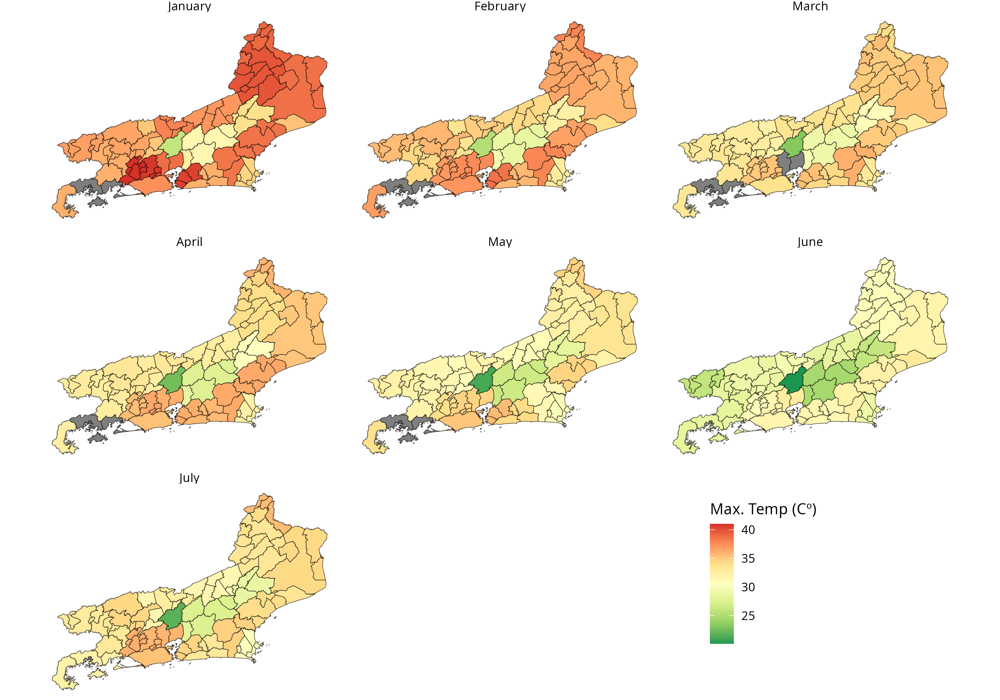

# climateBR: Download Rainfall, Temperature, and Wind Data from Brazil

[](https://CRAN.R-project.org/package=climateBR) [](https://cran.r-project.org/package=climateBR)

**climateBR** is designed to help scientists study climate shocks in Brazil. It provides tools to download, process, and analyze historical meteorological data, along with records of natural disasters and fire hotspots that can be linked to the weather data.

## Data sources

| Source | Data | Coverage | Function |
|--------|------|----------|----------|
| [INMET](https://portal.inmet.gov.br) — National Institute of Meteorology | Hourly observations from automatic weather stations (rainfall, temperature, wind, humidity, pressure, and radiation) | 2000–present | `download_inmet()`, `build_inmet_dataset()`, `read_inmet()` |
| [APAC](https://www.apac.pe.gov.br) — Pernambuco's Water and Climate Agency | Monthly tables of daily rainfall from rain gauges in Pernambuco, by mesoregion | 1961–present | `download_apac()` |
| [MIDR](https://atlasdigital.mdr.gov.br) — Ministry of Integration and Regional Development (*Atlas Digital de Desastres no Brasil*, with CEPED/UFSC) | Natural disaster records registered in S2iD, classified by COBRADE, with human, material, and environmental damage and economic losses | 1991–present | `download_disasters()` |
| [INPE](https://data.inpe.br/queimadas/) — National Institute for Space Research (*Programa Queimadas*) | Satellite-detected fire hotspots, with days without rain, precipitation, fire risk, and fire radiative power | 1998–present | `download_firespots()` |

Disaster records can be joined to the bundled `municipality` and `mun_stations` datasets through the 7-digit IBGE code (`Cod_IBGE_Mun` ↔ `code_ibge7`), which links them to the nearest INMET stations. Fire hotspots do not carry IBGE codes; link them through their coordinates (e.g. a spatial join with municipality boundaries) or by municipality and state names.

## Installation

``` r
# From CRAN
install.packages("climateBR")

# Development version (latest features)
remotes::install_github("kaiorb52/climateBR")
```

## Example: Maximum temperature in Rio de Janeiro state (2026)

First, download the historical INMET CSV files with `download_inmet()`.

Next, convert the raw files into a partitioned Apache Arrow dataset with `build_inmet_dataset()`. This step is essential: each station's CSV file has about 8,000 rows per year, and with more than 500 stations in Brazil, a single year can reach about 4 million observations. That is too much for most computers to handle efficiently as plain CSV files.

Finally, use `read_inmet()` to query the processed dataset.

``` r
library(climateBR)
library(dplyr)
data("mun_stations")

# The package includes datasets that speed up data aggregation.
# For example, `mun_stations` was created with `nearest_stations()` and links
# each of Brazil's 5,570 municipalities to its five nearest stations.

download_inmet(
  years = 2026,
  unzip_to = "data/raw/inmet"
)

build_inmet_dataset(
  input = "data/raw/inmet/",
  output = "data/processed/inmet/"
)

df_inmet <- read_inmet(path = "data/processed/inmet")

temp_rj <- df_inmet |> 
  group_by(ano, mes, codigo_wmo) |> 
  summarise(
    temp_max = max(
      temperatura_maxima_na_hora_ant_aut_c,
      na.rm = TRUE
    )
  ) |> 
  left_join(
    mun_stations |> 
      filter(station_order == 1) |> 
      select(state_muni, code_ibge7, code_wmo), 
    by = c("codigo_wmo" = "code_wmo")
  ) |> 
  filter(state_muni == "RJ") |> 
  collect() |> 
  filter(is.finite(temp_max)) |> # drop station-months with no readings
  arrange(-temp_max)
  
# A tibble: 644 × 6
# # Groups:   ano, mes [7]
#      ano   mes codigo_wmo temp_max state_muni code_ibge7
#    <int> <int> <chr>         <dbl> <chr>           <dbl>
#  1  2026     1 A601           41   RJ            3305554
#  2  2026     1 A601           41   RJ            3304144
#  3  2026     1 A601           41   RJ            3303609
#  4  2026     1 A601           41   RJ            3302270
#  5  2026     1 A601           41   RJ            3302007
#  6  2026     1 A621           40.8 RJ            3305109
#  7  2026     1 A621           40.8 RJ            3303500
#  8  2026     1 A621           40.8 RJ            3303203
#  9  2026     1 A621           40.8 RJ            3302858
# 10  2026     1 A621           40.8 RJ            3300456
# # ℹ 634 more rows
# # ℹ Use `print(n = ...)` to see more rows
```

``` r

library(ggplot2)

temp_rj |> 
  ggplot(aes(x = as.character(mes), y = temp_max)) +
  geom_boxplot() +
  theme_linedraw() +
  labs(y = "Max. temp. (°C)", x = "Month")
  
```



``` r

library(geobr)

mun_24 <- geobr::read_municipality(year = 2024)

mun_rj <- mun_24 |> 
  filter(abbrev_state == "RJ") |> 
  select(code_muni, geom)

# `temp_rj` already has one row per municipality and month
mun_temp_rj <- mun_rj |> 
  left_join(
    temp_rj, 
    by = c("code_muni" = "code_ibge7")
  )

mun_temp_rj$mes <- factor(
  mun_temp_rj$mes,
  levels = 1:12,
  labels = month.name
)

ggplot() +
  geom_sf(data = mun_temp_rj, aes(fill = temp_max)) +
  scale_fill_distiller(palette = "RdYlGn") +
  facet_wrap(.~mes) +
  labs(fill = "Max. temp. (°C)") +
  theme_void() +
  theme(
    legend.position = c(0.785, 0.185),
    plot.background = element_rect(fill = "white")
  )
  
```



## Example: Rainfall in Pernambuco (APAC)

``` r
library(climateBR)
library(dplyr)

apac <- download_apac(years = 2026)

```

## Example: Natural disasters

``` r
library(climateBR)
library(dplyr)

disasters <- download_disasters()

```

## Example: Fire hotspots

``` r
library(climateBR)
library(dplyr)

firespots <- download_firespots(years = 2025)

```

## License

This project is licensed under the MIT License.

## Citation

To cite package ‘climateBR’ in publications use:

-   Bárbara K (2026). *climateBR: Download Rainfall, Temperature, and Wind Data from Brazil*. R package version 0.3.0, <https://CRAN.R-project.org/package=climateBR>.

```

@Manual{,
  title = {climateBR: Download Rainfall, Temperature, and Wind Data from Brazil},
  author = {Kaio Bárbara},
  year = {2026},
  note = {R package version 0.3.0},
  url = {https://CRAN.R-project.org/package=climateBR},
}
```
