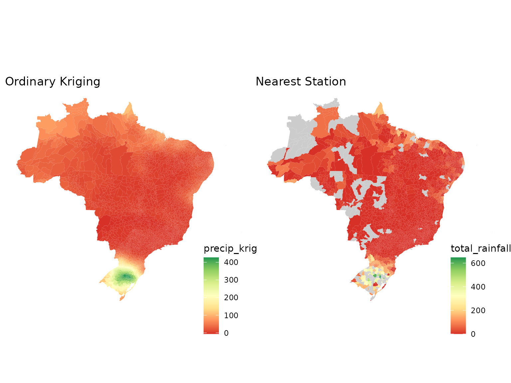
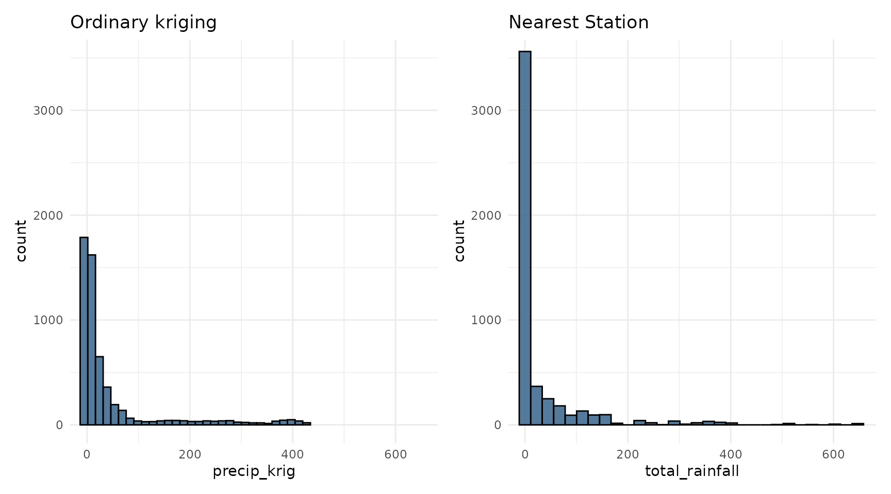

# Spatial Interpolation Using Ordinary Kriging

## Introduction

Spatial interpolation is commonly used to estimate meteorological
variables at locations where no direct observations are available. The
[`kriging_inmet()`](../reference/kriging_inmet.md) function implements
**ordinary kriging** using weather station observations and spatial
prediction locations provided as `sf` objects.

This vignette demonstrates how to interpolate accumulated rainfall from
INMET weather stations.

``` r

library(climateBR)
library(dplyr)
library(sf)
library(ggplot2)
library(patchwork)
```

## Input Data

The example uses rainfall observations from the 2024 Rio Grande do Sul
flood event together with municipality geometries.

``` r

data("floods_rs")
data("mun_stations")

# Alternative for: geobr::read_municipality(year = 2024)
tmp <- tempfile(fileext = ".rda")
on.exit(unlink(tmp), add = TRUE)

download.file(
  "https://github.com/kaiorb52/dados_municipais/raw/main/mun_24.rda",
  destfile = tmp,
  mode = "wb"
)

load(tmp)
```

The station observations are converted to an `sf` object and projected
to a planar coordinate reference system suitable for distance-based
spatial analysis.

``` r

rain_sf <- floods_rs |>
  st_as_sf(coords = c("lon", "lat"), crs = 4326) |>
  st_transform(crs = 29193)

mun_centroid <- mun_24 |>
  select(code_muni, geom) |>
  mutate(
    ponto = st_point_on_surface(geom)
  ) |>
  st_drop_geometry()

mun_grid_sf <- mun_centroid |>
  st_as_sf() |>
  st_transform(crs = 29193)
```

## Running the Kriging Model

The [`kriging_inmet()`](../reference/kriging_inmet.md) function computes
an empirical variogram, fits a spherical variogram model, and performs
ordinary kriging predictions for the target locations.

``` r

krig_result <- kriging_inmet(
  stations_df = rain_sf,
  mun_geo     = mun_grid_sf
)
#> [using ordinary kriging]
```

The predicted values (`var1.pred`) and prediction variances (`var1.var`)
are then attached to the municipality dataset.

``` r

mun_pred <- mun_centroid |>
  select(code_muni) |>
  bind_cols(
    krig_result |>
      st_drop_geometry() |>
      select(
        precip_krig     = var1.pred,
        precip_krig_var = var1.var
      )
  )
```

## Visualizing Kriging Predictions

The following map displays municipality-level rainfall estimates
obtained through ordinary kriging.

``` r

p1 <- mun_24 |>
  left_join(mun_pred, by = "code_muni") |>
  ggplot() +
  geom_sf(aes(fill = precip_krig), color = NA) +
  labs(title = "Ordinary Kriging") +
  scale_fill_distiller(
    palette = "RdYlGn",
    direction = 1,
    na.value = "grey80"
  ) +
  theme_void() +
  theme(
    legend.position = c(0.9, 0.1)
  )
```

## Comparison with the Nearest-Station Approach

For comparison, the map below assigns each municipality the rainfall
value from its closest weather station.

``` r


mun_floods <- floods_rs |>
  left_join(
    mun_stations |>
      filter(station_order == 1),
    by = c("code_wmo" = "code_wmo")
  )

p2 <- mun_24 |>
  left_join(
    mun_floods |>
      select(code_ibge7, total_rainfall),
    by = c("code_muni" = "code_ibge7")
  ) |>
  ggplot() +
  geom_sf(aes(fill = total_rainfall), color = NA) +
  labs(title = "Nearest Station") +
  scale_fill_distiller(
    palette = "RdYlGn",
    direction = 1,
    na.value = "grey80"
  ) +
  theme_void() +
  theme(
    legend.position = c(0.9, 0.1)
  )
```

The figure below compares rainfall estimates generated using ordinary
kriging against values obtained from the nearest-station approach.



Ordinary kriging generally produces smoother spatial surfaces and
incorporates information from multiple nearby stations, whereas the
nearest-station method assigns the same value to all municipalities
linked to a given station and may introduce abrupt spatial
discontinuities.

Each approach has important advantages and limitations. Ordinary kriging
accounts for spatial dependence and usually generates more realistic
spatial patterns than others methods. However, because it is a
statistical interpolation technique, it may produce physically
unrealistic estimates, such as negative rainfall values, and it often
smooths the spatial field, reducing the magnitude of extreme
precipitation events. As a result, very high observed rainfall totals
may be underestimated in the interpolated surface. In contrast, the
nearest-station approach preserves the original observed values,
including extremes, but can create large areas with identical rainfall
estimates because multiple municipalities may be assigned to the same
station. This can lead to artificial boundaries and abrupt changes
between neighboring municipalities that do not reflect the continuous
nature of precipitation processes.


