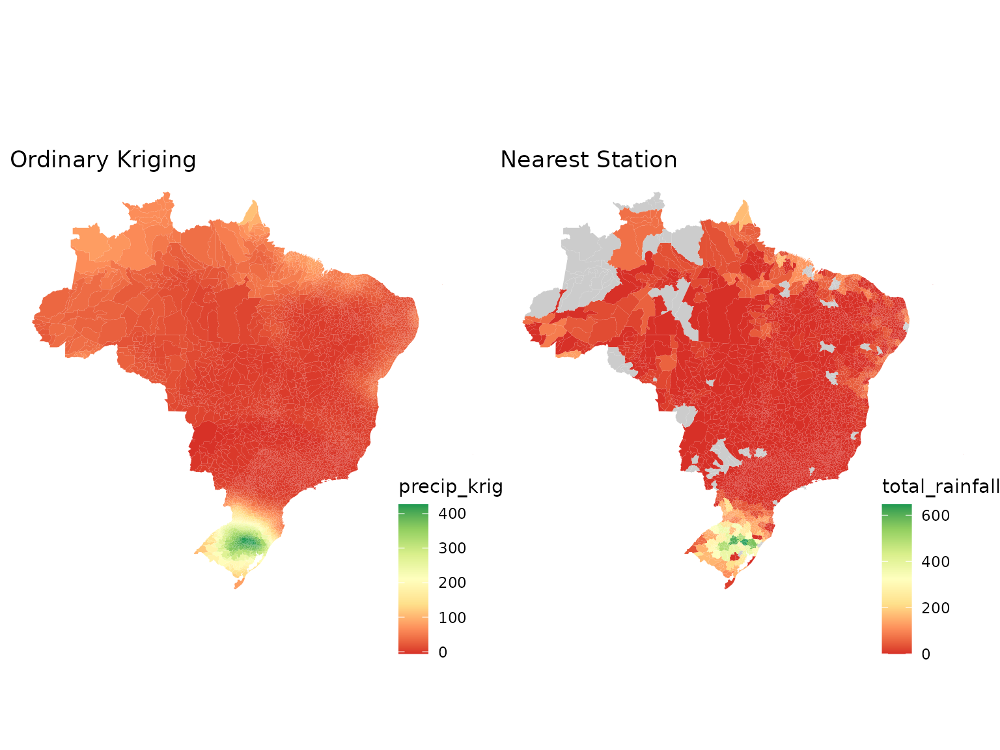
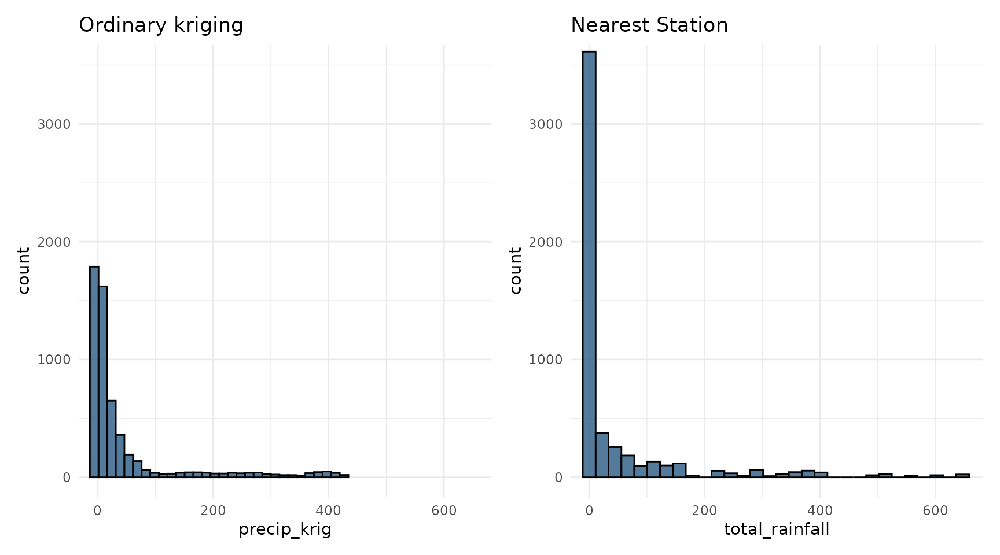

# Spatial Interpolation Using Ordinary Kriging

## Introduction

Spatial interpolation is commonly used to estimate meteorological
variables at locations where no direct observations are available. The
[`kriging_inmet()`](../reference/kriging_inmet.md) function implements
**ordinary kriging** using weather station observations and spatial
prediction locations provided as `sf` objects.

This vignette demonstrates how to interpolate accumulated rainfall from
INMET weather stations.

``` r

library(climateBR)
library(dplyr)
library(sf)
library(ggplot2)
library(patchwork)
```

## Input Data

The example uses rainfall observations from the 2024 Rio Grande do Sul
flood event together with municipality geometries.

``` r

data("floods_rs")
data("mun_stations")

# Alternative to: geobr::read_municipality(year = 2024)
tmp <- tempfile(fileext = ".rda")
on.exit(unlink(tmp), add = TRUE)

download.file(
  "https://github.com/kaiorb52/dados_municipais/raw/main/mun_24.rda",
  destfile = tmp,
  mode = "wb"
)

load(tmp)
```

The station observations are converted to an `sf` object and projected
to a planar coordinate reference system, which is required for
distance-based spatial analysis.

``` r

rain_sf <- floods_rs |>
  st_as_sf(coords = c("lon", "lat"), crs = 4326) |>
  st_transform(crs = 29193)

mun_centroid <- mun_24 |>
  select(code_muni, geom) |>
  mutate(
    ponto = st_point_on_surface(geom)
  ) |>
  st_drop_geometry()

mun_grid_sf <- mun_centroid |>
  st_as_sf() |>
  st_transform(crs = 29193)
```

## Running the Kriging Model

The [`kriging_inmet()`](../reference/kriging_inmet.md) function computes
an empirical variogram, fits a spherical variogram model, and performs
ordinary kriging predictions for the target locations.

``` r

krig_result <- kriging_inmet(
  stations_df = rain_sf,
  mun_geo     = mun_grid_sf
)
#> [using ordinary kriging]
```

The predicted values (`var1.pred`) and prediction variances (`var1.var`)
are then attached to the municipality dataset.

``` r

mun_pred <- mun_centroid |>
  select(code_muni) |>
  bind_cols(
    krig_result |>
      st_drop_geometry() |>
      select(
        precip_krig     = var1.pred,
        precip_krig_var = var1.var
      )
  )
```

## Visualizing Kriging Predictions

The following map displays municipality-level rainfall estimates
obtained through ordinary kriging.

``` r

p1 <- mun_24 |>
  left_join(mun_pred, by = "code_muni") |>
  ggplot() +
  geom_sf(aes(fill = precip_krig), color = NA) +
  labs(title = "Ordinary Kriging") +
  scale_fill_distiller(
    palette = "RdYlGn",
    direction = 1,
    na.value = "grey80"
  ) +
  theme_void() +
  theme(
    legend.position = c(0.9, 0.1)
  )
```

## Comparison with the Nearest-Station Approach

For comparison, the map below assigns each municipality the rainfall
value from its closest weather station.

``` r


data("inmet_stations")

mun_stations2 <- mun_stations |> 
  left_join(inmet_stations |> select(code_wmo, creation_year)) |> 
  filter(creation_year <= 2024) |> 
  arrange(distance) |> 
  distinct(code_ibge7, .keep_all = TRUE)

mun_floods <- floods_rs |>
  left_join(
    mun_stations2,
    by = c("code_wmo" = "code_wmo")
  )

p2 <- mun_24 |>
  left_join(
    mun_floods |>
      select(code_ibge7, total_rainfall),
    by = c("code_muni" = "code_ibge7")
  ) |>
  ggplot() +
  geom_sf(aes(fill = total_rainfall), color = NA) +
  labs(title = "Nearest Station") +
  scale_fill_distiller(
    palette = "RdYlGn",
    direction = 1,
    na.value = "grey80"
  ) +
  theme_void() +
  theme(
    legend.position = c(0.9, 0.1)
  )
```

The figure below compares rainfall estimates generated using ordinary
kriging against values obtained from the nearest-station approach.



Ordinary kriging generally produces smoother spatial surfaces and
incorporates information from multiple nearby stations, whereas the
nearest-station method assigns the same value to all municipalities
linked to a given station and may introduce abrupt spatial
discontinuities.

Each approach has advantages and limitations:

- **Ordinary kriging** accounts for spatial dependence and usually
  produces more realistic spatial patterns. However, as a statistical
  interpolation method, it can produce physically impossible values
  (such as negative rainfall) and tends to smooth the surface, so very
  high rainfall totals may be underestimated.
- **Nearest station** preserves the observed values, including extremes.
  However, many municipalities may share the same station, which creates
  large areas with identical values and artificial boundaries between
  neighboring municipalities. Real rainfall does not change abruptly at
  these boundaries.

The histograms below compare the distribution of municipality-level
estimates from both approaches.


