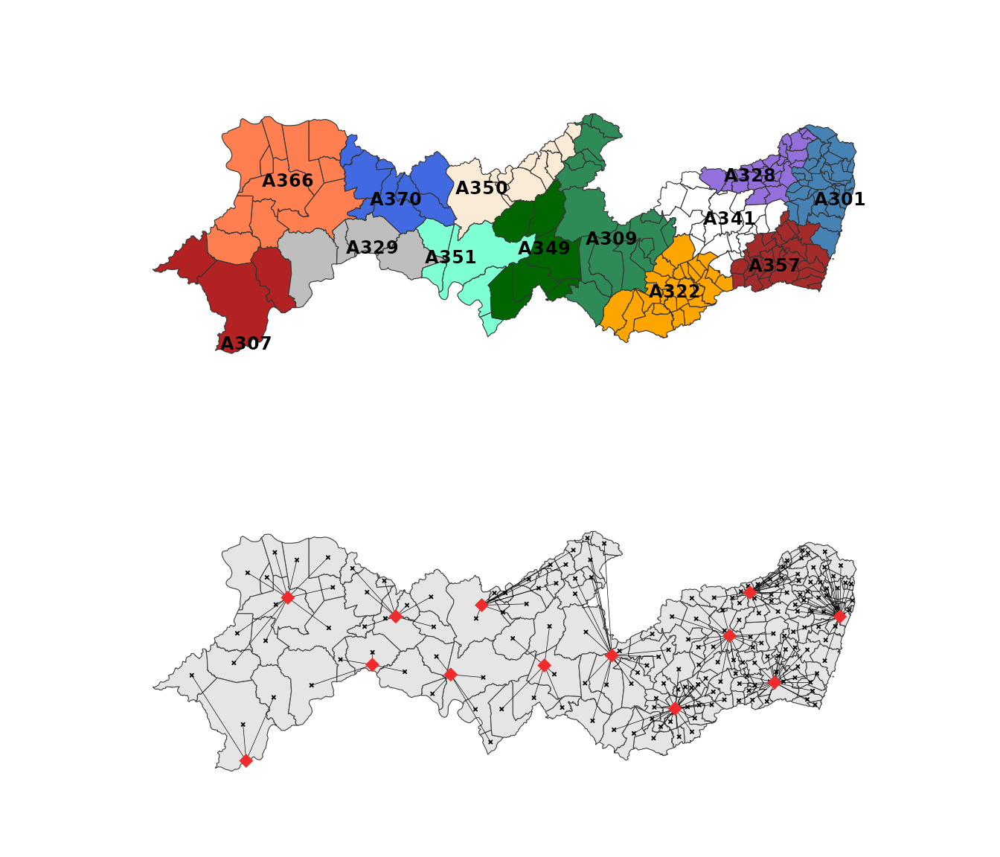

# Finding the Closest INMET Station for Each Municipality

## Introduction

Many climate analyses need to assign each municipality to its closest
weather station.
[`nearest_stations()`](../reference/nearest_stations.md) automates this
by finding the nearest INMET station(s) for every municipality.

``` r


library(climateBR)
library(dplyr)
library(ggplot2)
library(sf)
```

## Preparing the data

The package includes datasets of Brazilian municipalities
(`municipality`) and INMET weather stations (`inmet_stations`). This
example uses the state of Pernambuco (PE).

``` r

data("municipality")
data("inmet_stations")

municipality_pe <- municipality |>
  filter(
    state_muni == "PE",
    code_ibge7 != "2605459" # Fernando de Noronha
  )

inmet_stations_pe <- inmet_stations |>
  filter(state_station == "PE")
```

## Finding the nearest station

Use [`nearest_stations()`](../reference/nearest_stations.md) with
`n = 1` to find the closest station for each municipality.

``` r

mun_stations_pe <- nearest_stations(
  municipality = municipality_pe,
  inmet_stations = inmet_stations_pe,
  n = 1
)

head(mun_stations_pe)
#> # A tibble: 6 × 5
#>   state_muni code_ibge7 code_wmo distance station_order
#>   <chr>           <dbl> <chr>       <dbl>         <int>
#> 1 PE            2600054 A301        25.7              1
#> 2 PE            2600104 A350        79.5              1
#> 3 PE            2600203 A307       104.               1
#> 4 PE            2600302 A341        25.2              1
#> 5 PE            2600401 A357         9.32             1
#> 6 PE            2600500 A322        66.1              1
```

## Municipality–station connections

The top map colors each municipality by its nearest station. The bottom
map draws a line from each municipality centroid (×) to its nearest
station (◆).


