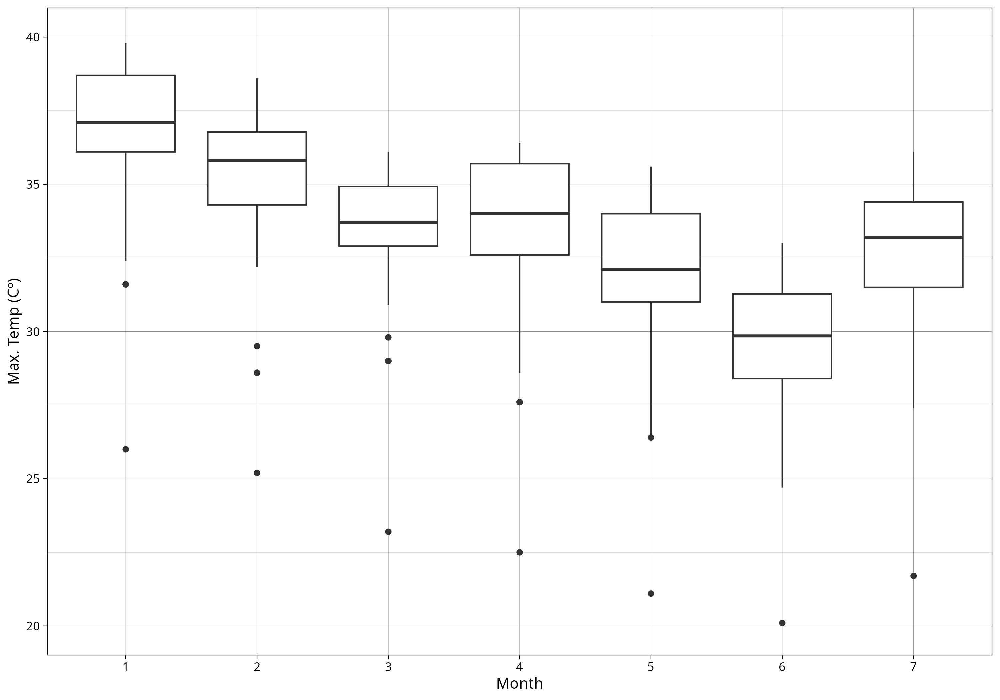
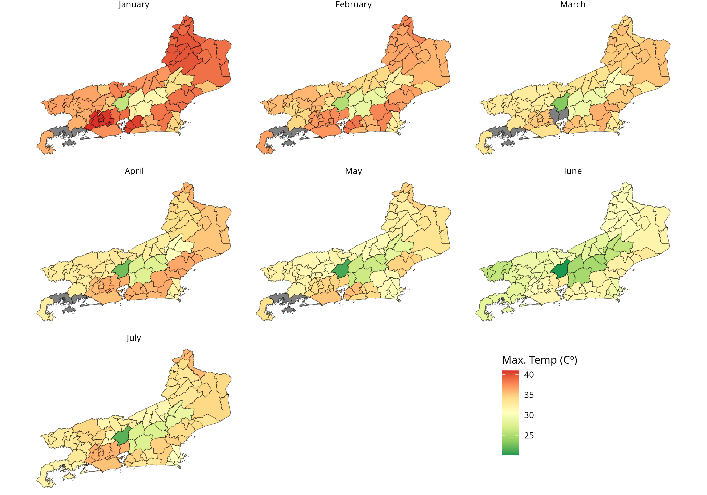

# climateBR: Download Rainfall, Temperature, and Wind Data from Brazil

[](https://CRAN.R-project.org/package=climateBR)
[](https://cran.r-project.org/package=climateBR)

**climateBR** was developed to help social scientists operationalize
research on climate shocks in Brazil. The package provides tools to
download, process, and analyze historical meteorological data from the
Brazilian National Institute of Meteorology (INMET).

## Installation

``` r

# From CRAN
install.packages("climateBR")

# or use the development version with latest features
remotes::install_github("kaiorb52/climateBR")
```

## Examples

With **climateBR**, you can download historical INMET data using the
[`download_inmet()`](reference/download_inmet.md) function, specifying
one or more years.

The downloaded raw station CSV files can then be processed into a
partitioned Apache Arrow dataset using
[`build_inmet_dataset()`](reference/build_inmet_dataset.md). Finally,
[`read_inmet()`](reference/read_inmet.md) can be used to query the
processed dataset.

``` r

library(climateBR)

download_inmet(
  years = 2026,
  unzip_to = "data/raw/inmet"
)

build_inmet_dataset(
  input = "data/raw/inmet/",
  output = "data/processed/inmet/"
)

df_inmet <- read_inmet(path = "data/processed/inmet")
```

The package also provides datasets containing information on the nearest
INMET stations to each municipality in Brazil.

``` r

data("mun_stations")
# The `mun_stations` dataset was created using the `nearest_stations()` function and contains the five nearest stations for each municipality.

temp_rj <- df_inmet |> 
  group_by(ano, mes, codigo_wmo) |> 
  summarise(
    temp_max = max(
      temperatura_maxima_na_hora_ant_aut_c,
      na.rm = TRUE
    )
  ) |> 
  left_join(
    mun_stations |> 
      filter(station_order == 1) |> 
      select(state_muni, code_ibge7, code_wmo), 
    by = c("codigo_wmo" = "code_wmo")
  ) |> 
  filter(state_muni == "RJ") |> 
  collect() |> 
  arrange(-temp_max)
  
# A tibble: 644 × 6
# # Groups:   ano, mes [7]
#      ano   mes codigo_wmo temp_max state_muni code_ibge7
#    <int> <int> <chr>         <dbl> <chr>           <dbl>
#  1  2026     1 A601           41   RJ            3305554
#  2  2026     1 A601           41   RJ            3304144
#  3  2026     1 A601           41   RJ            3303609
#  4  2026     1 A601           41   RJ            3302270
#  5  2026     1 A601           41   RJ            3302007
#  6  2026     1 A621           40.8 RJ            3305109
#  7  2026     1 A621           40.8 RJ            3303500
#  8  2026     1 A621           40.8 RJ            3303203
#  9  2026     1 A621           40.8 RJ            3302858
# 10  2026     1 A621           40.8 RJ            3300456
# # ℹ 634 more rows
# # ℹ Use `print(n = ...)` to see more rows
```

``` r


library(ggplot)

temp_rj |> 
  ggplot(aes(x = as.character(mes), y = temp_max)) +
  geom_boxplot() +
  theme_linedraw() +
  labs(y = "Max. Temp (Cº)", x = "Month") +
  ylim(20, 40)
  
```



``` r


library(geobr)

mun_24 <- geobr::read_municipality(year = 2024)

mun_rj <- mun_24 |> 
  filter(abbrev_state == "RJ") |> 
  select(code_muni, geom)

mun_temp_rj <- mun_rj |> 
  left_join(
    mun_stations |> filter(station_order == 1) |> select(code_ibge7, code_wmo), 
    by = c("code_muni" = "code_ibge7")
  ) |> 
  left_join(
    temp_rj, 
    by = c("code_wmo" = "codigo_wmo")
  )

mun_temp_rj$mes <- factor(
  mun_temp_rj$mes,
  levels = 1:12,
  labels = month.name
)

ggplot() +
  geom_sf(data = mun_temp_rj, aes(fill = temp_max)) +
  scale_fill_distiller(palette = "RdYlGn") +
  facet_wrap(.~mes) +
  labs(fill = "Max. Temp (Cº)") +
  theme_void() +
  theme(
    legend.position = c(0.785, 0.185),
    plot.background = element_rect(fill = "white")
  )
  
```



## License

This project is licensed under the MIT License.

## Citation

To cite package ‘climateBR’ in publications use:

- Bárbara K (2026). *climateBR: Download Rainfall, Temperature, and Wind
  Data from Brazil*. R package version 0.1.0,
  <https://CRAN.R-project.org/package=climateBR>.

&nbsp;


    @Manual{,
      title = {climateBR: Download Rainfall, Temperature, and Wind Data from Brazil},
      author = {Kaio Bárbara},
      year = {2026},
      note = {R package version 0.1.0},
      url = {https://CRAN.R-project.org/package=climateBR},
    }
